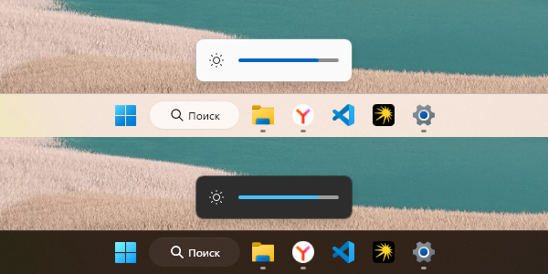

# SetLuma



A small WPF tool. Allows you to control the backlight of the monitor using keyboard shortcuts. Works in the background. You can add it to autorun.
Your monitor must have DDC-CI support.

# Building

Install the NET.SDK and open the file ```build.bat```

# Using

The brightness of the backlight is adjusted using hotkeys. By default, these are Ctrl+F1 and Ctrl+F2. You can assign your keyboard shortcuts in the ```HotkeyConfig.ini``` file.
After launching the application, it will run in the background and wait for input without displaying any icons and settings, except for the Windows 11 style brightness slider.
